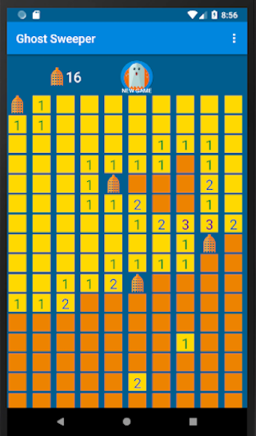
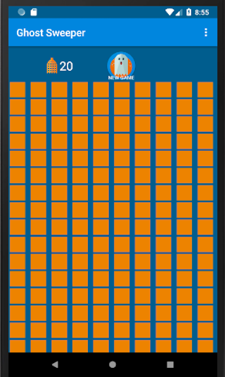

# GhostSweeper
GhostSweeper game written in Java for Android (project 2 from CodeClan's 16-week software development course). Game logic based on the classic Minesweeper - the player navigates the board as they uncover the tiles and try to trap all evil spirits lurking in the shadows.

## Learning objectives
- build a complete app in Android Studio,
- practice creating multiple activities and recyclable views (e.g. GridView),
- understand Activity lifecycle and callbacks for navigating transitions (onCreate(), onStart(), onResume(), onPause(), onStop(), and onDestroy()),
- practice stroing app data in Shared Preferences,
- use SOLID design practices to write flexible and maintainable code,
- gain a better understanding of the four pillars of OOP (abstractian, encapsulation, inheritance and polymorphism)

## The app can be downloaded from the <a href="https://play.google.com/store/apps/details?id=com.e20.ewa.ghostsweeper">Google Play Store</a>. Reviews and feedback very welcome!

 

